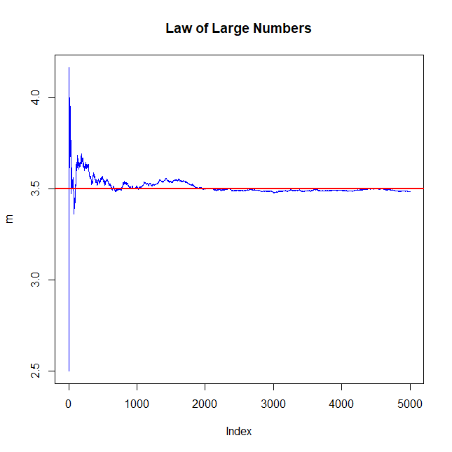

# Law of Large Numbers Simulation using R

This project provides a visual and statistical simulation of the Law of Large Numbers (LLN) using the R programming language. It demonstrates how empirical results converge toward theoretical probabilities as the number of trials increases.

---

## 📐 Mathematical Concept

According to the Law of Large Numbers, the sample mean ($\bar{X}_n$) of $n$ independent and identically distributed (i.i.d.) random variables converges to the expected value ($\mu$) as $n \to \infty$:

$$\bar{X}_n \to \mu \quad \text{as} \quad n \to \infty$$

In this project, we simulate rolling a fair 6-sided die. The theoretical expected value ($\mu$) is calculated as:

$$\mu = \frac{1 + 2 + 3 + 4 + 5 + 6}{6} = 3.5$$

---

## 🛠️ How the Simulation Works

The simulation executes the following steps in R:
1. Generates Random Data: Simulates 5,000 independent dice rolls using sample().
2. Computes Running Average: Calculates the cumulative sum of the outcomes divided by the current trial number at each step ($1$ to $5,000$).
3. Data Visualization: Plots the running average to observe the transition from initial high volatility to final stability around the theoretical mean of 3.5.

---

## 📊 Visual Result

As shown in the generated plot, the running average (blue line) fluctuates heavily during the first few trials due to random noise. However, as the number of trials approaches 5,000, the sample mean stabilizes and aligns perfectly with the theoretical expectation of 3.5 (red line).

